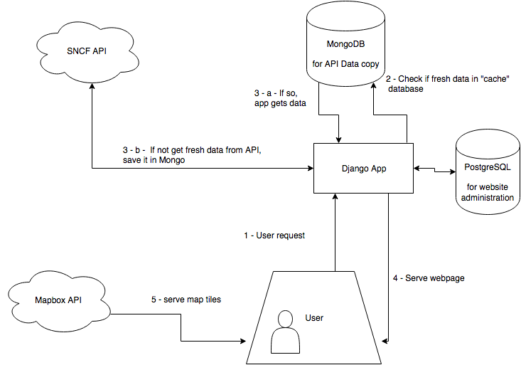
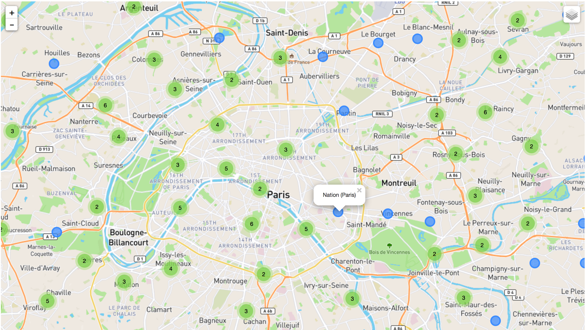
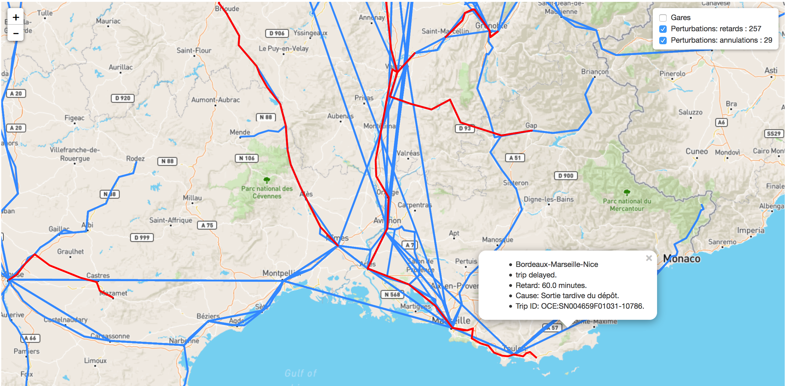
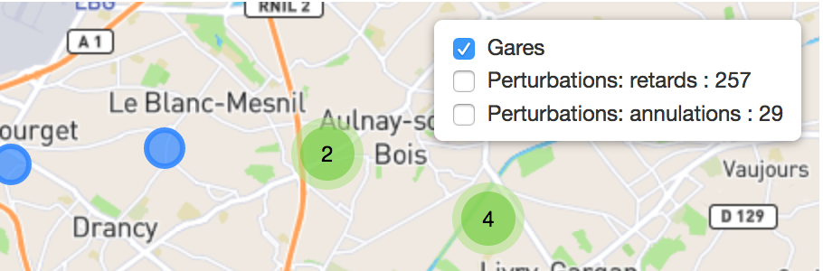

# Project documentation

## Django

### Databases

Difficult to use MongoDB as django integrated database.
I prefer to use PostgreSQL as base database for Django, and query MongoDB with custom scripts.

Other solution would be to use PostgreSQL postgis to handle geo queries, but it would require to write all exact models in django, and I'm not sure yet of the struture.

So: solution is:
- use postgres as regular database for django (do not specifically need geo operations)
- use non "django-integrated" MongoDB, that I will query with custom python scripts

Benefits:
- postgres stability for website structure
- mongodb flexibility (schemaless is really a relief in this case given the data structures)

Limits:
- if I want to benefit from the relational benefits, complex queries, I will need to use Postgres, and write all schemas.
- or I might write redondant flat collections in Mongodb, but not easy to update I gess.

### Django PostgreSQL and PostGIS requirements is I wanted to use postgis
https://docs.djangoproject.com/en/1.10/ref/contrib/gis/install/postgis/

Postgres.app is a standalone PostgreSQL server that includes the PostGIS extension. You will also need to install gdal and libgeoip with Homebrew.
pip install psycopg2

### MongoDB admin
http://blog.mongodb.org/post/28925264384/macosx-preferences-pane-for-mongodb
brew install mongodb

## Architecture

## Leaflet
http://leafletjs.com/reference-1.0.2.html

## TODO

Convert all necessary data in geoJson objects.?
- convert stop points into geojson objects
- convert lines

Load data in goeJson format in MongoDB.

Add method to parseApi to connect to MongoDB and update data.

Structure better JavaScript frontend code to build map with multiple layers and update all layers in a single ajax call.

## Leads

- Real time: everything on disruptions
- Add journey_patterns to tiles

## How it looks

## Annexe
http://doc.navitia.io/#public-transport-objects
https://github.com/OpenTransport/vocabulary/blob/master/vocabulary.md

https://api.sncf.com/v1/coverage/sncf/routes?depth=3
https://api.sncf.com/v1/coverage/sncf/journey_pattern_points?depth=3
