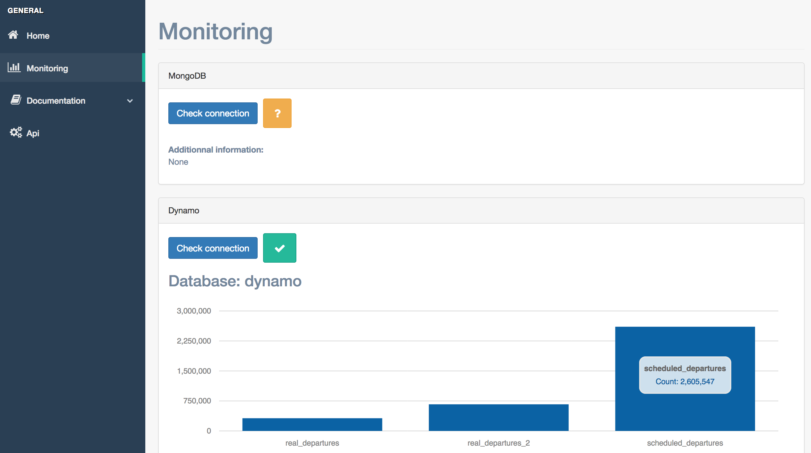
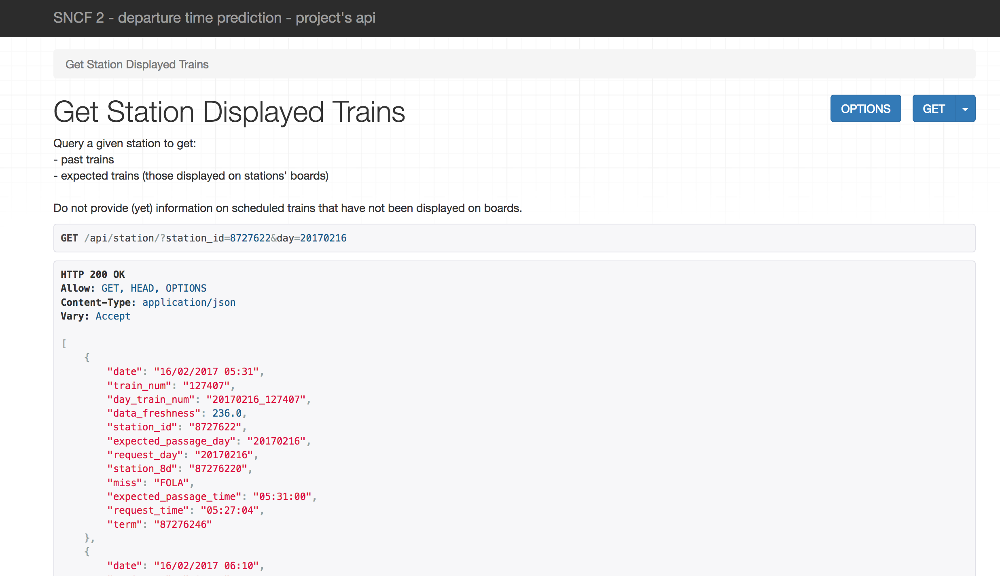
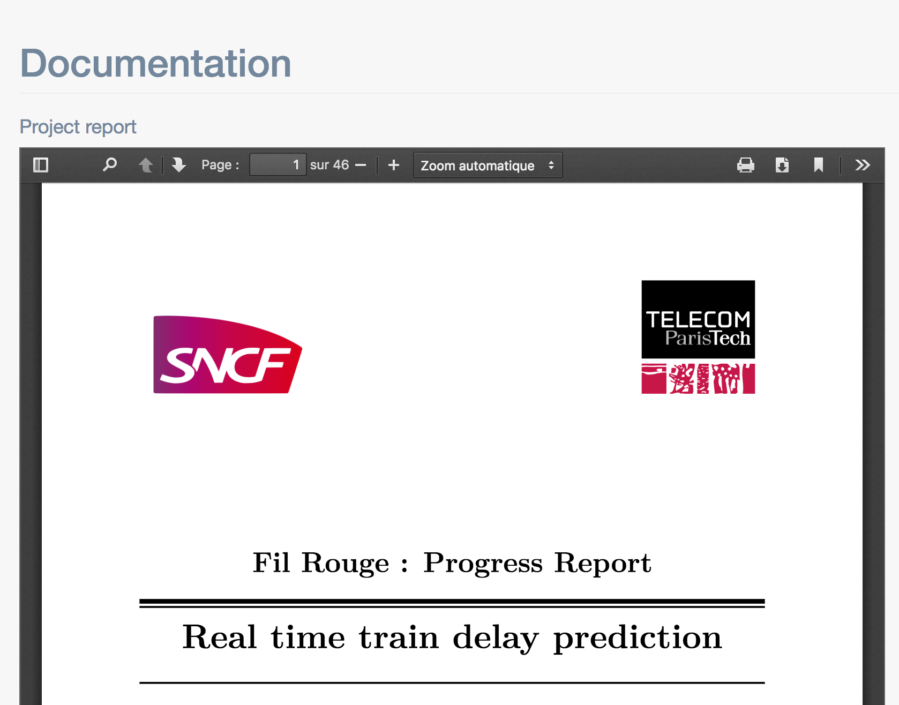

# SNCF Project Website

## Overview

This website was developed for a project with SNCF's R&D department:
- to expose a custom API serving real-time predictions about trains departure times.
- to display the project's documentation
- to make databases (Mongo and Dynamo) status available

This repository is only one of the project's repositories. You can find:
- a repository with Vagrant and Salt files used to automate deployment, [here](https://github.com/leonardbinet/Salt-Vagrant-master-mode).
- a repository with the application used to extract/transform/load data from transilien's API into Mongo and Dynamos databases, [here](https://github.com/leonardbinet/Transilien-Api-ETL).

## How it looks

## Annexe
http://doc.navitia.io/#public-transport-objects
https://github.com/OpenTransport/vocabulary/blob/master/vocabulary.md

https://api.sncf.com/v1/coverage/sncf/routes?depth=3
https://api.sncf.com/v1/coverage/sncf/journey_pattern_points?depth=3
